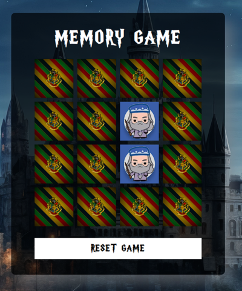

# Jogo da Memória - Tema Harry Potter 🧙‍♂️✨

Bem-vindo ao Jogo da Memória inspirado no universo mágico de Harry Potter! Este projeto, desenvolvido com HTML, CSS e JavaScript, oferece uma experiência básica.

## Sobre o Projeto

O Jogo da Memória é uma atividade clássica de emparelhamento de cartas, onde o jogador deve combinar pares idênticos de cartas para vencer. Neste projeto, as cartas são tematizadas com personagens.

  

## Como Jogar

1. Abra o link [Jogo Da Memória](https://mrestefani.github.io/Memory-Game-HP/)
3. Clique em uma carta para revelar a imagem.
5. Clique em outra carta para encontrar o par correspondente.
6. Continue emparelhando as cartas até encontrar todos os pares.

## Cartas

  
  
  
  

  
  
  
   

## Recursos e Tecnologias Utilizadas

- HTML5
- CSS3
- JavaScript

## Agradecimentos

- Agradeço aos professores e colegas que me inspiraram durante o curso de Fundamentos do CSS e Fundamentos do HTML.

  ✨ Divirta-se jogando e que a magia esteja sempre ao seu lado! ✨ 

 
